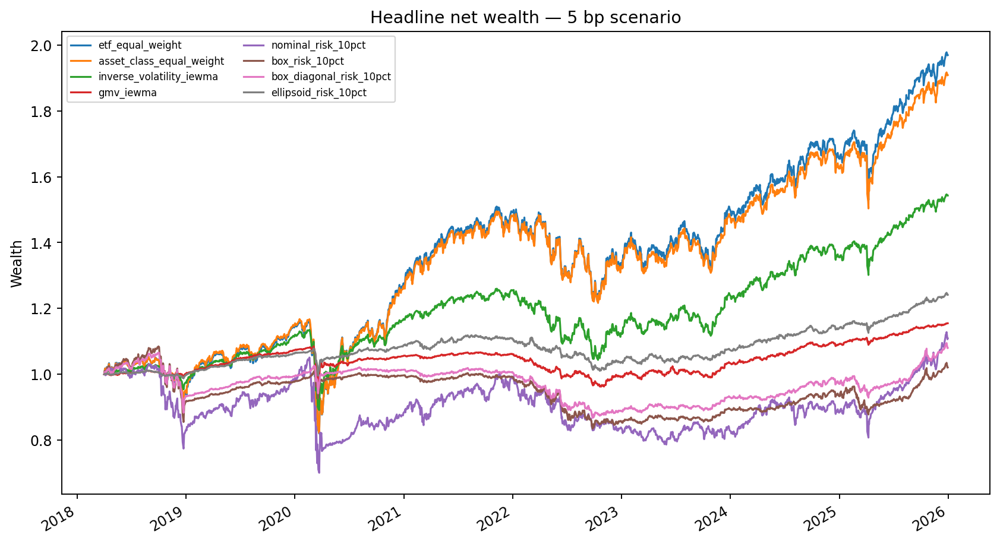

# Robust Portfolio Optimization: Methods and Results

## 1. Research question

This project asks:

> When does uncertainty-aware mean-variance optimization improve portfolio decisions after forecasting, risk, universe redundancy, accounting, and trading frictions are separated?

The experiment settings are in [`configs/final_analysis.json`](../configs/final_analysis.json), and the reported tables and figures are in [`results/final/`](../results/final/).

## 2. Mathematical formulation

For 147 ETFs, the feasible set at decision date $t$ is

$$\mathcal{W}_t = \{\, w : \mathbf{1}^\top w = 1,\; 0 \le w_i \le 0.10 \,\}.$$

The nominal problem under a common risk ceiling is

$$\max_{w \in \mathcal{W}_t} \hat{\mu}_t^\top w \quad \text{s.t.} \quad w^\top \hat{\Sigma}_t w \le \sigma_\star^2.$$

The expected-return estimate is the annualized arithmetic mean of the preceding 504 daily returns. The covariance estimate is corrected IEWMA with 21-day volatility and 63-day correlation half-lives, standardized using the prior volatility state, winsorized at 4.2, annualized by 252, and eigenvalue-floored as configured in [`configs/core_experiment.json`](../configs/core_experiment.json). We distinguish between the requested ceiling $\sigma_\star$, attained model-predicted volatility, common-base predicted volatility, and realized volatility.

## 3. Robust formulations

Let $S = \mathrm{diag}(s)$, where $s$ contains bootstrap standard errors of annualized mean returns. The box and ellipsoidal radii, $\rho_{\mathrm{box}}$ and $\rho_{\mathrm{ell}}$, are calibrated separately. Under box uncertainty,

$$\mathcal{U}_\mu^{\mathrm{box}} = \{\, \hat{\mu} + Su : \|u\|_\infty \le \rho_{\mathrm{box}} \,\}.$$

Norm duality gives

$$\inf_{\mu \in \mathcal{U}_\mu^{\mathrm{box}}} \mu^\top w = \hat{\mu}^\top w - \rho_{\mathrm{box}} \|Sw\|_1.$$

Because the portfolios are long-only,

$$\|Sw\|_1 = s^\top w,$$

so the resulting objective is

$$\hat{\mu}^\top w - \rho_{\mathrm{box}} s^\top w.$$

For ellipsoidal mean uncertainty,

$$\mathcal{U}_\mu^{\mathrm{ell}} = \{\, \hat{\mu} + C_\mu^{1/2} u : \|u\|_2 \le \rho_{\mathrm{ell}} \,\},$$

which gives

$$\inf_{\mu \in \mathcal{U}_\mu^{\mathrm{ell}}} \mu^\top w = \hat{\mu}^\top w - \rho_{\mathrm{ell}} \sqrt{w^\top C_\mu w}.$$

For diagonal variance uncertainty, $\Sigma=\hat{\Sigma}+\mathrm{diag}(\delta)$ with $|\delta_i|\leq\kappa\hat{\Sigma}_{ii}$. The worst-case covariance contribution is

$$\sup_{\Sigma} w^\top \Sigma w = w^\top \left[ \hat{\Sigma} + \kappa \,\mathrm{diag}(\mathrm{diag}(\hat{\Sigma})) \right] w.$$

Bootstrap standard errors, $C_\mu$, both mean-uncertainty radii, and $\kappa$ are estimated from each date's 504-row training window using 500 circular moving-block draws, 21-observation blocks, deterministic seeds, and 95% empirical coverage.

## 4. Data

The stored returns CSV contains 2,764 daily adjusted-return observations for a balanced panel of 147 ETFs, from January 5, 2015 through December 30, 2025. Prices were downloaded with yfinance; the stored CSVs are the inputs to reproduction. The universe was built from a current, manually chosen ETF list with sufficient historical coverage, so it is survivor-conditioned rather than a point-in-time historical ETF universe. The repository does not contain an inactive-fund master, dead-fund total returns, terminal proceeds, stable identifier history, merger and liquidation records, or point-in-time classification flags, so we cannot reconstruct a survivorship-bias-free historical universe from the available data. Static asset-class labels are used throughout the experiment.

The portfolio evaluation starts on April 2, 2018 and contains 31 quarterly decisions through October 1, 2025, with returns through December 30, 2025. The start requires four completed prior quarterly validation windows, each preceded by 504 fitting observations. These windows determine eligibility for evaluation; the current code uses fixed estimator settings and training-window bootstrap calibration, with no per-fold performance-based model selection. The historical period was observed during development, so this is a rolling forecast evaluation with no untouched holdout.

## 5. Execution and backtesting

At rebalance date $t$, all forecasts use rows strictly before $t$. Existing holdings earn the close-$(t-1)$-to-close-$t$ return, the target portfolio executes at the close of $t$, and the new holdings first earn the following return. Holdings then drift until the next quarterly rebalance.

Reported turnover is measured from drifted pre-trade weights:

$$z_t = w_t - w_{t^-}, \qquad TO_t^{\mathrm{gross}} = \|z_t\|_1, \qquad TO_t^{\mathrm{oneway}} = \tfrac{1}{2}\|z_t\|_1.$$

Dollar trades account for the reduction in NAV caused by costs. With pre-trade holdings $h_{t^-}$, pre-trade NAV $V_{t^-}$, post-trade NAV $V_t^+$, and cost rate $c$, the engine solves

$$V_t^++c\|w_tV_t^+-h_{t^-}\|_1=V_{t^-}$$

The weight-based turnover measure and actual traded-dollar fraction can therefore differ when costs are positive. Initial formation is reported separately in turnover summaries and included in net returns. Linear transaction-cost scenarios of 0, 1, 5, 10, and 25 bp are charged to risky-asset dollar trades through the self-financing NAV equation. These cost levels are scenario assumptions rather than reconstructed historical ETF-specific costs.

## 6. Forecasting models

We compare sample covariance, EWMA, corrected IEWMA, and Ledoit-Wolf linear shrinkage as sequential covariance forecasts. Table 1 reports out-of-sample Gaussian covariance loss, equal-weight volatility bias and RMSE, condition number, effective rank, and GMV forecast-diagnostic volatility. The loss uses $[\log\det(\Sigma)+r^{\top}\Sigma^{-1}r]/147$ with daily covariance, averaged within each subsequent holding period and then equally across periods. The equal-weight and GMV diagnostics apply fixed forecast-date weights to daily returns within each period and omit costs. Headline portfolio performance in Section 8 uses drifted holdings and self-financing execution.

Ledoit-Wolf had the lowest mean covariance loss at -10.2203 and the lowest equal-weight volatility RMSE at 0.0828. Its median condition number was 3,935.6, compared with 293,767.7 for IEWMA, 889,784.7 for sample covariance, and 1,477,956.9 for EWMA. Corrected IEWMA is used as the main covariance estimator in the portfolio experiments.

## 7. Risk calibration

Under the common ex-ante risk ceiling, the 10% ceiling was binding on 100% of nominal decisions, about 19.4% of box decisions, about 45.2% of box-plus-diagonal decisions, and 0% of ellipsoidal decisions. Average attained model-predicted risks were 10.00%, 5.01%, 7.44%, and 3.05% respectively. The methods therefore operate at materially different attained risks even when they share the same ceiling. Diagonal covariance inflation can also raise minimum feasible predicted risk: the 6% ceiling was infeasible for box-plus-diagonal on four dates in the full-universe grid.

To separate robustness from differences in risk-taking, we also solve

$$\max_{w \in \mathcal{W}_t} \left[ R_{\mathrm{rob},t}(w) - \frac{\gamma_t}{2} w^\top \Sigma_{\mathrm{decision},t} w \right], \qquad \gamma_t \ge 0,$$

using deterministic bracket expansion and bisection to seek 10% predicted volatility. The attainable interval is bounded below by the constrained GMV solution and above by the zero-$\gamma$ robust optimum.

| Model | Dates attained | Dates target unattainable |
|---|---:|---:|
| Nominal | 31 | 0 |
| Box | 6 | 25 |
| Box + diagonal covariance | 14 | 17 |
| Ellipsoidal | 0 | 31 |

All nonattainment at the 10% target occurred because the zero-$\gamma$ robust optimum was already below the requested risk; negative risk aversion was not used. Only nominal supplied a complete 10% target-attainment path, and its 5-bp results are nearly identical to the nominal common-ceiling path.

Across the tested common-ceiling grids, the four optimized model families have no common range of average attained predicted risk: the largest family-level lower endpoint is 6.00%, while the smallest upper endpoint is 3.05%, so the intersection is empty. Post-hoc realized-risk ranges are also disjoint. These are ranges of average attained risk over complete paths in the tested grids, not a proof about every possible portfolio or parameter value. They do not support an equal-risk ranking across the full model set.

## 8. Benchmarks and realized performance

ETF equal weight allocates equally across ETFs. Asset-class equal weight allocates equally across the static asset classes, then equally within each class. Inverse volatility uses IEWMA individual-ETF volatilities with the weight cap; GMV minimizes IEWMA portfolio variance under the same investment constraints.

At the fixed 5-bp transaction-cost scenario:

| Strategy | Net CAGR | Realized volatility | Sharpe (zero RF) | Recurring one-way turnover |
|---|---:|---:|---:|---:|
| ETF equal weight | 9.16% | 14.32% | 0.684 | 2.69% |
| Asset-class equal weight | 8.72% | 14.00% | 0.668 | 2.73% |
| Inverse volatility (IEWMA) | 5.77% | 9.37% | 0.646 | 7.78% |
| GMV (IEWMA) | 1.88% | 3.40% | 0.564 | 14.46% |
| Nominal MVO, 10% ceiling | 1.34% | 16.00% | 0.164 | 47.48% |
| Box robust, 10% ceiling | 0.26% | 7.61% | 0.072 | 24.89% |
| Box + diagonal, 10% ceiling | 0.99% | 6.21% | 0.190 | 22.90% |
| Ellipsoidal, 10% ceiling | 2.83% | 3.58% | 0.798 | 13.81% |

ETF equal weight had the highest net CAGR among these strategies. Ellipsoidal robustness had the highest Sharpe under the zero-RF convention, while attaining much lower predicted and realized volatility. These are not same-risk portfolios.

Net CAGR is $[\prod_{d=1}^{N}(1+r_d^{\mathrm{net}})]^{252/N}-1$. Realized volatility is the sample standard deviation of daily net returns times $\sqrt{252}$. Sharpe is $252\bar{r}^{\mathrm{net}}/\sigma_{\mathrm{realized}}$, using a zero risk-free rate. Recurring one-way turnover is averaged across rebalances after initial formation. The CSV fields `net_annualized_return` and `gross_annualized_return` retain their existing names for compatibility; both contain CAGR. Bootstrap intervals for `annualized_zero_rf_mean` concern arithmetic mean return.

All eight strategies use the same stored return path and execution convention. Failed model-date solves are recorded; strategies with incomplete targets are excluded from full-path performance tables, with failures retained in [`all_recorded_failures.csv`](../results/final/all_recorded_failures.csv).

## 9. Perturbation experiments

To measure input-to-weight sensitivity directly, we used four dates prespecified in the configuration—April 2, 2018; April 1, 2020; October 3, 2022; and October 1, 2025—and gave all four principal optimizers the same 24 shared 21-day circular moving-block training draws. For each draw, expected returns and IEWMA covariances were re-estimated while the baseline uncertainty-set geometry for that date was held fixed, isolating the effect of forecast perturbation on the resulting allocation.

We also applied deterministic mean shocks of

$$\hat{\mu} \pm s$$

and three covariance shocks: multiplying total variance by 1.10, blending correlation 10% toward the identity matrix, and multiplying the leading eigenvalue by 1.10. Each stressed covariance matrix is projected back to the positive semidefinite cone using the same eigenvalue floor as the main estimator.

Mean bootstrap L1 weight sensitivity fell from 1.156 for nominal MVO to 0.649 for box, 0.552 for box plus diagonal covariance, and 0.174 for ellipsoidal, corresponding to reductions of roughly 44%, 52%, and 85% relative to nominal. Mean cosine similarity rose from 0.455 for nominal to 0.686, 0.767, and 0.965 respectively. On these four dates, the robust formulations produced substantially more stable portfolio weights than nominal MVO. None of the 560 direct or clone perturbation solves failed.

## 10. ETF redundancy and synthetic clones

At every rebalance, correlations are estimated using only the preceding training window. Pairwise distance is

$$d_{ij} = \sqrt{\frac{1 - \rho_{ij}}{2}}.$$

Average-linkage clustering is applied at correlation-equivalent cutoffs of 0.80, 0.90, 0.95, and 0.975. Each cluster medoid minimizes average within-cluster distance, with a lexicographic tie-break. The full-universe calibrated uncertainty radius is retained and the corresponding uncertainty geometry is subset to the selected medoids.

Median IEWMA condition number fell from about 293,768 in the full universe to 9,412, 56,191, 137,145, and 161,400 across the four cutoffs. Average medoid counts were 40.5, 62.9, 82.7, and 97.8 respectively. The reduced universes were better conditioned, but turnover did not consistently decrease: GMV recurring turnover was 14.46% in the full universe versus 21.85%, 24.55%, 19.78%, and 17.53% across the four medoid universes.

Fourteen medoid model-date solves were infeasible under the unchanged 10% volatility ceiling, concentrated at the more aggressive clustering thresholds and under diagonal covariance inflation. These cases remain marked as infeasible, and affected full-path performance rows are incomplete.

The clone experiment adds synthetic near-duplicates of SPY or AGG to the training universe on the same four dates, with relative noise standard deviations of 0%, 1%, and 5%. For the box model, security-weight L1 distortion averaged about 0.025 while asset-class distortion was essentially zero. For box plus diagonal covariance, security-weight distortion averaged about 0.011 and economic-exposure distortion about 0.007. For these clone tests, the smaller economic-exposure changes are consistent with substitution among similar instruments. The result is limited to the selected assets and dates. The clones are synthetic perturbation devices rather than historical securities.

## 11. Statistical inference

The inference panel contains joint daily 5-bp net returns for the eight benchmark and optimized strategies. We use a stationary bootstrap with 2,000 replications, expected block length 10, seed 36129, and shared resampled time indices across strategies. Intervals are paired 95% percentile intervals. Because the repository does not contain a validated full-period risk-free series, Sharpe ratios are reported under a zero risk-free-rate assumption.

Relative to nominal MVO, estimated Sharpe differences and intervals were:

| Strategy | Delta Sharpe | 95% interval |
|---|---:|---:|
| ETF equal weight | 0.521 | [0.091, 0.955] |
| Asset-class equal weight | 0.504 | [0.075, 0.948] |
| Inverse volatility (IEWMA) | 0.482 | [0.017, 0.969] |
| GMV | 0.400 | [-0.216, 1.114] |
| Box | -0.092 | [-0.668, 0.451] |
| Box + diagonal | 0.027 | [-0.552, 0.575] |
| Ellipsoidal | 0.634 | [0.034, 1.204] |

These intervals reflect sampling uncertainty in realized returns but do not remove the differences in attained risk across the robust models. We also compute the Deflated Sharpe Ratio across 27 complete core-experiment strategy specifications at the fixed 5-bp cost level. No DSR probability exceeded 0.762. Because the candidate return series and model specifications are strongly correlated, and because the finite candidate set does not represent every modeling decision, we treat DSR as a secondary diagnostic rather than a primary ranking criterion.

## 12. Regime analysis

At each rebalance, trend is measured by trailing 252-day SPY return. Volatility is the trailing 63-day annualized SPY standard deviation and is classified as high when it exceeds the expanding median of completed prior 63-day estimates. This produced 11 calm risk-on decisions, 14 volatile risk-on decisions, six stress/risk-off decisions, and no weak/cooling decisions. Regime results are descriptive because the individual state samples are small and the historical period is limited.

## 13. Sensitivity analysis

The sensitivity analysis varies calibrated $\rho_{\mathrm{box}}$ and $\kappa$ using multipliers of 0, 0.5, 1.0, and 1.5, and varies the maximum asset weight across 5%, 10%, and 20%, using the same four evaluation dates. Box-plus-diagonal allocations move materially away from the baseline outside the calibrated parameter combination. Mean L1 change is about 1.09 at

$$(\rho_{\mathrm{box}},\kappa) = (0,0).$$

Changing the weight cap from 10% produces average L1 allocation changes commonly near 0.8 to 1.0. The optimized portfolios are therefore sensitive to concentration limits and robust-radius choices even when the robust formulations are less sensitive to resampled return and covariance inputs. The full transaction-cost grid is reported separately. We did not vary the estimation-window length because doing so would require redesigning the nested-history comparison.

## 14. Limitations

The main limitations are:

- The ETF universe is survivor-conditioned rather than point-in-time.
- Asset classifications are static.
- The evaluation uses rolling forecasts, but the historical period was observed during development and is not an untouched holdout.
- The close-$t$ execution convention is an approximation imposed by the available total-return data.
- Cash earns zero because a validated historical risk-free series is not included.
- Transaction costs are linear scenarios rather than ETF- and date-specific historical estimates.
- Direct sensitivity and clone experiments use four selected dates.
- Medoid bootstrap sensitivity was not estimated.
- No weak/cooling regime occurred in the outer sample.
- DSR assumptions are imperfect, and the candidate count cannot represent every modeling choice.

## 15. Conclusion

On the four prespecified perturbation dates, robust optimization materially reduced the sensitivity of portfolio weights to resampled expected returns and covariance estimates. The largest stability improvement came from the ellipsoidal formulation, while the box and box-plus-diagonal formulations also moved substantially less than nominal MVO. That added stability did not translate into consistent realized-return outperformance: ETF equal weight had the highest net CAGR among the eight headline strategies, and the robust portfolios often operated at materially lower predicted risk than nominal MVO under the same volatility ceiling.

Redundancy reduction improved covariance conditioning but did not consistently reduce turnover. The synthetic-clone experiments also suggest that some security-level instability reflects substitution among economically similar ETFs rather than large changes in underlying exposure.

## 16. Reproduction

Run the core experiment and final analysis from the repository root using the [README commands](../README.md#reproduction). The scripts read stored data and write detailed diagnostics, four final tables, and thirteen figures under `artifacts/`. The committed `results/final/run_manifest.json` records the original run, including its original configuration hashes and machine paths; those paths are historical records, not portable input locations. Display-label updates and corrected snapshot hashes are recorded in that manifest. New runs record their own code, configuration, input hashes, and environment.
